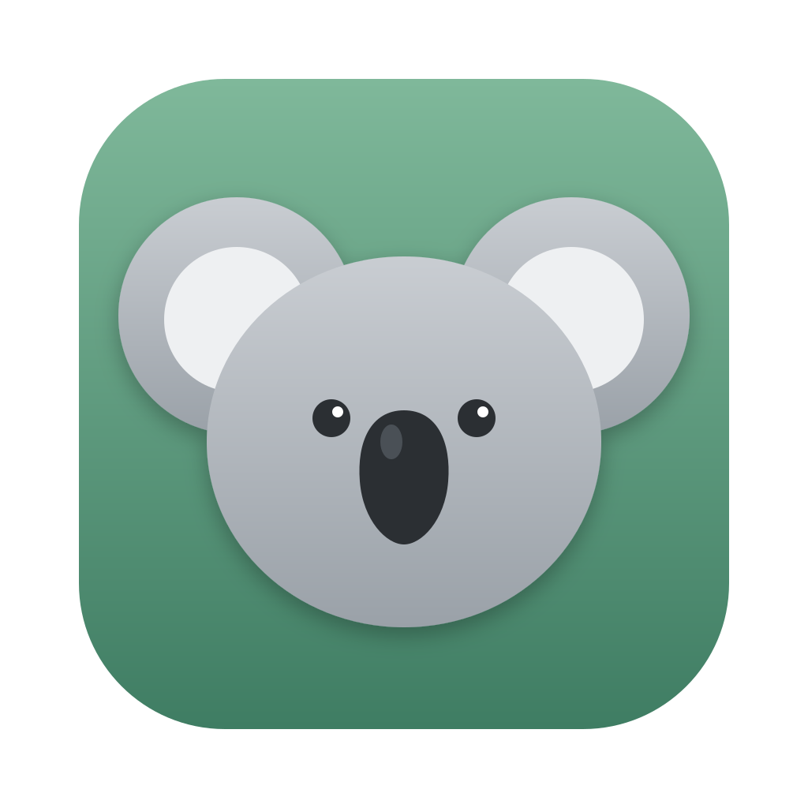

<p align="center">
  
</p>

<h1 align="center">Koala</h1>

<p align="center">
  A browser engine written in Rust from the HTML and CSS specs.
</p>

<p align="center">
  <a href="https://github.com/AlvinKuruvilla/koala/actions/workflows/miri.yml"></a>
  <a href="https://github.com/AlvinKuruvilla/koala/actions/workflows/python.yml"></a>
  
  <a href="LICENSE"></a>
</p>

Koala parses, styles, lays out, and paints web pages without WebKit, Blink,
or Gecko. Each algorithm cites its section of the WHATWG or CSS spec and
quotes the spec text next to the code that implements it. JavaScript runs on
[Boa](https://github.com/boa-dev/boa).

The goal is a browser that LLM agents can drive directly. Agents that browse
today drive Chromium from outside, through screenshots or accessibility-tree
snapshots. Koala will instead hand an agent the layout tree as typed data
(boxes, roles, reading order) and each page's forms, links, and buttons as
actions. That interface does not exist yet.
Today Koala renders pages to PNG from the command line, or in a desktop
browser with tabs.

## Contents

- [Status](#status)
- [Getting started](#getting-started)
- [Architecture](#architecture)
- [Development](#development)
- [License](#license)

## Status

| Area | Supported |
|---|---|
| HTML | WHATWG tokenizer and tree builder, including all 2,231 named character references, tables, and forms |
| CSS | Type, class, ID, attribute, and combinator selectors; cascade; custom properties; shorthands |
| Layout | Block, inline, inline-block, flexbox, grid, tables, floats, margin collapsing, replaced elements |
| Positioning | `static`, `relative`, `absolute`, `fixed`, `sticky`; stacking contexts; `opacity`; overflow clipping |
| Painting | Text with weight, style, and decoration; backgrounds; borders with radius; box shadows; images |
| JavaScript | DOM bindings (`querySelector`, `addEventListener`, element and text APIs), timers, WPT `testharness.js` |
| Network | HTTP(S), `file:`, and `data:` URLs; per-destination `Accept` headers; the server's page on HTTP errors |

Not supported: media queries, pseudo-elements, `z-index`, transforms,
animations, and font fallback.

## Getting started

Koala needs a Rust toolchain with 2024 edition support. The browser's UI is
[Slint](https://slint.dev), a Rust crate, so Cargo builds everything. The
recipes below use [`just`](https://github.com/casey/just).

Open the browser:

```bash
just gui
```

This builds `Koala.app` and runs it under `lldb`, so a crash prints a
backtrace. The bundle is macOS-only; elsewhere, run
`cargo run --bin koala-ui`.

Render a page from the command line:

```bash
cargo run --bin koala -- -S out.png https://example.com   # screenshot
cargo run --bin koala -- https://example.com              # DOM tree
cargo run --bin koala -- --layout https://example.com     # layout tree
cargo run --bin koala -- --html '<h1>Hello</h1>' --layout # inline HTML
```

The default viewport is 1280×720; `--width` and `--height` change it.

## Architecture

A page moves through the engine top to bottom. When JavaScript mutates the
DOM, the page goes back through the cascade and everything after it.

```text
bytes ─► HTML tokenizer ─► tree builder ─► DOM ◄──── JavaScript (Boa)
                                            │
CSS ───► CSS tokenizer ──► parser ──► cascade ─► computed styles
                                            │
                                   layout ─► box tree
                                            │
                                    paint ─► display list
                                            │
                                   raster ─► pixels
```

```text
koala/
├── crates/
│   ├── koala-common/   URLs, images, warnings, allocation counting
│   ├── koala-fetch/    WHATWG Fetch: requests, destinations, senders
│   ├── koala-dom/      arena-allocated DOM tree
│   ├── koala-html/     HTML tokenizer and tree builder
│   ├── koala-css/      CSS parser, cascade, layout, paint
│   ├── koala-js/       Boa runtime and DOM bindings
│   ├── koala-browser/  document pipeline and software rasterizer
│   ├── koala-wpt/      web-platform-tests glue
│   ├── koala-debug/    diagnostic probes for Boa and memory use
│   └── koala-std/      no_std collections written for koala
├── koala-cli/          the `koala` binary
├── koala-ui/           the desktop browser (Slint)
├── tools/koala-lab/    performance comparisons between builds
└── res/                fonts, fixtures, and test pages
```

[`CLAUDE.md`](CLAUDE.md) describes the spec-commenting conventions every
engine crate follows.

## Development

```bash
cargo test                  # all Rust tests
cargo test -p koala-css     # one crate
cargo clippy --workspace
just py-check               # ruff, mypy, and pytest for the Python tools
```

### Measuring performance

`just lab compare` builds two commits, loads each page of a recorded corpus
in fresh processes, and reports which stages changed and by how much. With no
arguments it compares the working tree against where the branch left
`master`:

```bash
just lab corpus record        # record the corpus pages once
just lab compare              # this branch vs. master
just lab compare HEAD~3 HEAD  # any two commits
```

Recorded pages replay without the network, so both builds see the same bytes.
A change counts only when it passes a Mann-Whitney test across seven
processes per build, with a Holm correction across stages.

### Conformance

```bash
just wpt-setup                      # once: create the wptrunner venv
just wpt /css/CSS2/visudet/         # run a WPT directory
just dashboard                      # browse recorded runs
```

### Debugging layout

```bash
cargo run --bin koala --features layout-trace -- -S out.png <url> 2> trace.txt
```

The trace tags each line by subsystem: `[FLEX]`, `[INLINE]`, `[BLOCK STEP`,
`[MEASURE]`, `[LAYOUT DEPTH]`.

## License

[MIT](LICENSE)
